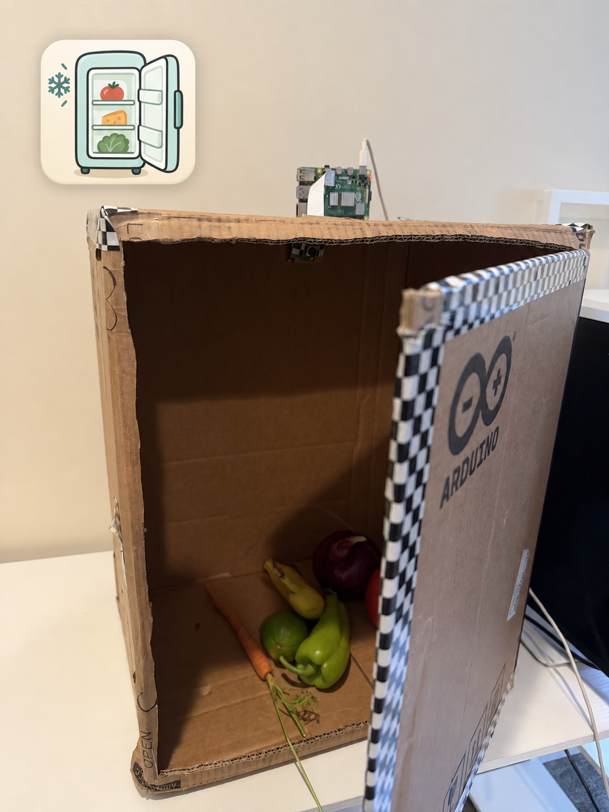
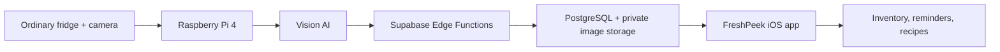

# FreshPeek

<p align="center">
  
</p>

**A smart add-on that turns an ordinary refrigerator into an AI-assisted food tracker.**

FreshPeek uses a Raspberry Pi camera, multimodal AI, Supabase, and an iOS app to record food entering or leaving a refrigerator. It helps users see what they have, use expiring food first, and generate recipes from selected ingredients—without buying a new smart fridge.

> FreshPeek is a retrofit system: mount the compact camera module inside an existing refrigerator and add AI inventory management without replacing the appliance or scanning barcodes.

## What it does

- Detects a door-opening event from the change in scene brightness.
- Captures a time-ordered burst with a short exposure to reduce motion blur.
- Uses vision AI to identify food and classify its movement as `in` or `out`.
- Sends normalized events to Supabase Edge Functions.
- Adds, merges, restores, or removes inventory records through idempotent database operations.
- Reuses known shelf-life rules and asks Qwen for a default only when a food is new.
- Shows inventory in a SwiftUI app, sorted by expiration urgency.
- Supports manual add, edit, swipe-to-delete, notification preferences, and AI recipe generation.

## Engineering highlights

### Temporal multimodal reasoning

FreshPeek sends a labeled, time-ordered burst instead of relying on a single image. The vision model tracks the food itself across frames, distinguishes multiple items in one door event, identifies each item, and determines whether its trajectory is entering or leaving.

### Camera-aware edge capture

The Raspberry Pi performs continuous sensing locally. Separate open/close brightness thresholds provide hysteresis, while a 5.5 ms locked exposure reduces hand-motion blur. Frames are captured every 200 ms and automatic exposure is restored after each event.

### Hybrid AI pipeline

The system supports OpenAI vision for temporal food recognition and a Qwen-VL-compatible fallback. Qwen also powers shelf-life estimation and recipe generation in the cloud, allowing each model to be used for the task it handles best.

### Reliable event processing

Every recognition event receives a stable event ID. Supabase Edge Functions validate the device, normalize the result, and execute inventory changes through PostgreSQL transactions. Idempotency prevents duplicate updates, and failed Pi uploads are saved locally for retry.

### Confidence-aware inventory matching

The backend combines normalized food names with visual reference frames. For uncertain outgoing events, it can compare the new observation against stored inventory images before removing an item. Reference images remain in private storage and are not displayed in the app.

### Reusable shelf-life knowledge

Shelf-life estimates are cached in a database rule table. Known foods reuse the existing rule immediately; only previously unseen foods require a new model call.

### Complete product loop

The SwiftUI app turns recognition events into an actionable experience: urgency-based sorting, red/orange/green freshness states, editable records, manual correction, local reminders, cuisine preferences, and recipe generation from selected expiring ingredients.

## System architecture



## Repository layout

```text
pi/       Raspberry Pi capture, recognition, and cloud-upload code
backend/  Supabase migrations and Edge Functions
ios/      FreshPeek SwiftUI application
docs/     Product and UI design notes
```

## Hardware

- Raspberry Pi 4 Model B
- Raspberry Pi Camera Module 3 Wide (IMX708)
- A standard refrigerator or the cardboard development rig
- Stable 5 V / 3 A USB-C power for the Raspberry Pi 4

## Technology

- Python, Picamera2, NumPy
- OpenAI vision through the Responses API; Qwen-VL-compatible fallback scripts
- Supabase PostgreSQL, Storage, and Edge Functions
- SwiftUI and `supabase-swift`

## Quick start

### 1. Configure and deploy Supabase

Create a Supabase project, then run this from the repository root:

```bash
chmod +x backend/deploy_mvp.sh
./backend/deploy_mvp.sh
```

The script asks for project details and secrets interactively. Real credentials are written only to ignored local files or Supabase Secrets.

### 2. Configure the Raspberry Pi

Copy the Pi files to the Raspberry Pi user directory (the current prototype uses
`/home/leoy`; change the constants if your username is different):

```bash
scp pi/*.py pi/*.txt pi/*.example leoy@YOUR_PI_HOST:/home/leoy/
```

On the Pi, create the private configuration files and add your own credentials:

```bash
cp /home/leoy/fridge.env.example /home/leoy/fridge.env
cp /home/leoy/fridge_cloud.env.example /home/leoy/fridge_cloud.env
chmod 600 /home/leoy/fridge.env /home/leoy/fridge_cloud.env
```

Install the Python dependencies in a virtual environment on the Pi:

```bash
python3 -m venv --system-site-packages fridge-venv
fridge-venv/bin/python -m pip install --upgrade openai numpy
```

For a recognition-only OpenAI test:

```bash
/home/leoy/fridge-venv/bin/python /home/leoy/fridge_openai_test.py
```

For the OpenAI recognition path connected to the backend:

```bash
/home/leoy/fridge-venv/bin/python /home/leoy/fridge_openai_production.py
```

Only one camera script should run at a time. See [`pi/接入说明.md`](pi/接入说明.md) for more detail.

### 3. Configure the iOS app

1. Open `ios/冰箱助手.xcodeproj` in Xcode.
2. In `ios/冰箱助手/SupabaseService.swift`, replace the Supabase URL and publishable-key placeholders.
3. In `ios/冰箱助手/AppSecrets.swift`, replace the app-token placeholder with the private token generated during backend setup.
4. Select your own Apple development team and bundle identifier.
5. Build and run on an iPhone or simulator.

## Recognition contract

The production recognition path emits a minimal payload:

```json
{
  "foods": [
    { "name": "tomato", "direction": "in" },
    { "name": "carrot", "direction": "in" }
  ],
  "reason": "Both items move upward through the frame."
}
```

The cloud uploader adds an event ID and the captured frames before calling `ingest-event`. Database functions are idempotent, so retrying the same event does not apply it twice.

## Expiration colors

- **Red:** expired
- **Orange:** within the user-selected warning window
- **Green:** still fresh

## Security

No live API keys, device tokens, app tokens, database passwords, or Apple signing credentials are stored in this repository. Keep real values only in ignored environment files and Supabase Secrets. If a credential is ever committed, rotate it before deleting it from Git history.
